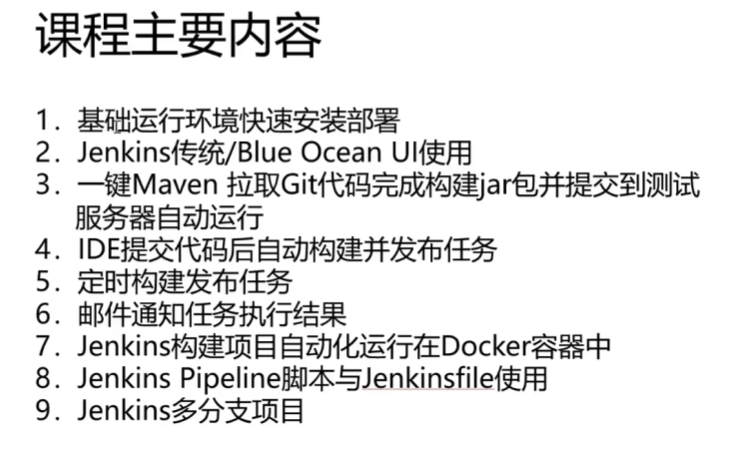
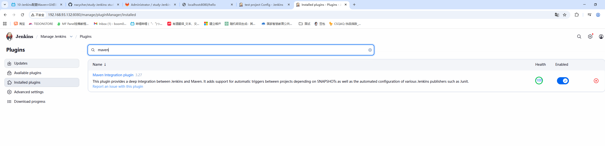

# study-Jenkins
study-Jenkins
## 视频地址 https://www.bilibili.com/video/BV1bS4y1471A




## Jenkins简介
CIDI，自动化集成、自动化部署

## Jenkins在开发中的位置和作用


## Jenkins+maven+git的集成使用

## 在docker下安装gitlab
```shell
# 安装gitlab，需要有较大内存
docker run --detach \
  --hostname 192.168.93.128 \
  --publish 443:443 --publish 80:80 \
  --name gitlab \
  --restart always \
  --volume /data/gitlab/config:/etc/gitlab:Z \
  --volume /data/gitlab/logs:/var/log/gitlab:Z \
  --volume /data/gitlab/data:/var/opt/gitlab:Z \
  --shm-size 256m \
  registry.gitlab.cn/omnibus/gitlab-jh:latest
```

## 在docker下安装jenkins
```shell
# 1. 先创建数据目录并赋权（必做）
mkdir -p /data/jenkins && chmod 777 -R /data/jenkins
# 2. 启动 Jenkins
docker run -d \
--name jenkins \
--restart always \
-p 8080:8080 \
-p 50000:50000 \
-v /data/jenkins:/var/jenkins_home \
-v /usr/bin/docker:/usr/bin/docker \
-v /var/run/docker.sock:/var/run/docker.sock \
-u root \
jenkins/jenkins:lts-jdk17
# 3. 设置jenkins代理
docker exec -it jenkins bash
mkdir -p /var/jenkins_home/updates
curl -o /var/jenkins_home/updates/default.json https://mirrors.aliyun.com/jenkins/updates/update-center.json
sed -i 's#http://updates.jenkins-ci.org/download#https://mirrors.aliyun.com/jenkins#g' /var/jenkins_home/updates/default.json
sed -i 's#https://updates.jenkins.io/download#https://mirrors.aliyun.com/jenkins#g' /var/jenkins_home/updates/default.json
sed -i 's#https://www.google.com/#https://www.baidu.com/#g' /var/jenkins_home/updates/default.json
echo -e "\n" >> /var/jenkins_home/updates/default.json
exit
docker restart jenkins
```
在jenkins中安装对应的部署项目要用的插件，这里是git和maven插件


## 配置maven和git部署项目
- 配置好git


- 安装maven、配置好项目的pom.xml路径


- 执行build，发现jar包已经被打到镜像中
